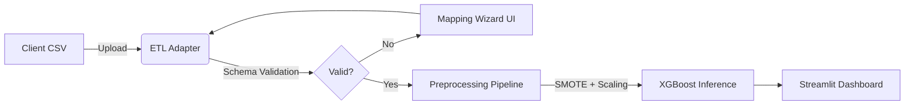

#  BizLens Analytics: Enterprise Customer Retention System


> [!CAUTION]
> ### ⚠️ This Project is Under Development
> This repository is currently a work in progress. Features may be incomplete, APIs might change frequently, and you might encounter bugs.

> **Live Demo:** [Will be updated soon]

##  Executive Summary
**BizLens** is a vertical SaaS application designed to operationalize machine learning for customer retention. Unlike standard dashboards that simply visualize history, BizLens uses **XGBoost** to predict future churn risk and prescribes automated retention strategies.

It features a **strict-schema ETL layer** to handle real-world data variability and a **decision-support interface** tailored for non-technical stakeholders.

##  Key Features

### 1.  Auto-Schema ETL Wizard
Real-world client data is messy. BizLens includes a dedicated **ETL Adapter** (`src/etl_adapter.py`) that:
- Detects schema mismatches in uploaded CSVs.
- Provides a GUI wizard to map client columns to the system's internal logic.
- Standardizes data types for robust inference.

### 2.  Predictive Risk Engine
- **Algorithm:** XGBoost Classifier (Gradient Boosted Trees).
- **Pipeline:** Imbalanced-Learn pipeline with SMOTE (Synthetic Minority Over-sampling) to handle class imbalance.
- **Output:** Real-time probability scoring (0-100%) mapped to 4 Risk Tiers (Low, Medium, High, Critical).

### 3.  Automated Strategy Recommendations
The system doesn't just predict risk; it suggests action.
- **Critical Risk (>75%):** Recommends aggressive retention offers (e.g., 15% discount).
- **High Risk (50-75%):** Recommends service audits and bundle up-selling.

##  Technical Architecture



## Local Setup

The Streamlit app expects a trained pipeline named `bizlens_churn_pipeline.joblib` in the project root. This binary is intentionally not committed; generate it locally before launching the app.

```bash
cd ~/Downloads
git clone https://github.com/AyushmanRaha/BizLens-Analytics.git
cd BizLens-Analytics
python3 -m venv .venv
source .venv/bin/activate
pip install -r requirements.txt
python src/train_model.py --data data/customer_churn_data.csv
streamlit run app.py
```

Place the Telco customer churn dataset at `data/customer_churn_data.csv`, or pass another CSV path with `--data`.

## Training the Model

Run the training script from the project root:

```bash
python src/train_model.py --data data/customer_churn_data.csv
```

The script trains the existing churn pipeline with numeric and categorical preprocessing, `OneHotEncoder(handle_unknown='ignore')`, `SMOTE`, and `XGBClassifier`. It drops `customerID` when present, cleans `TotalCharges` with `pd.to_numeric(..., errors='coerce')`, handles missing values inside the sklearn pipeline, prints train/test shapes and ROC AUC, and saves `bizlens_churn_pipeline.joblib` in the project root.
